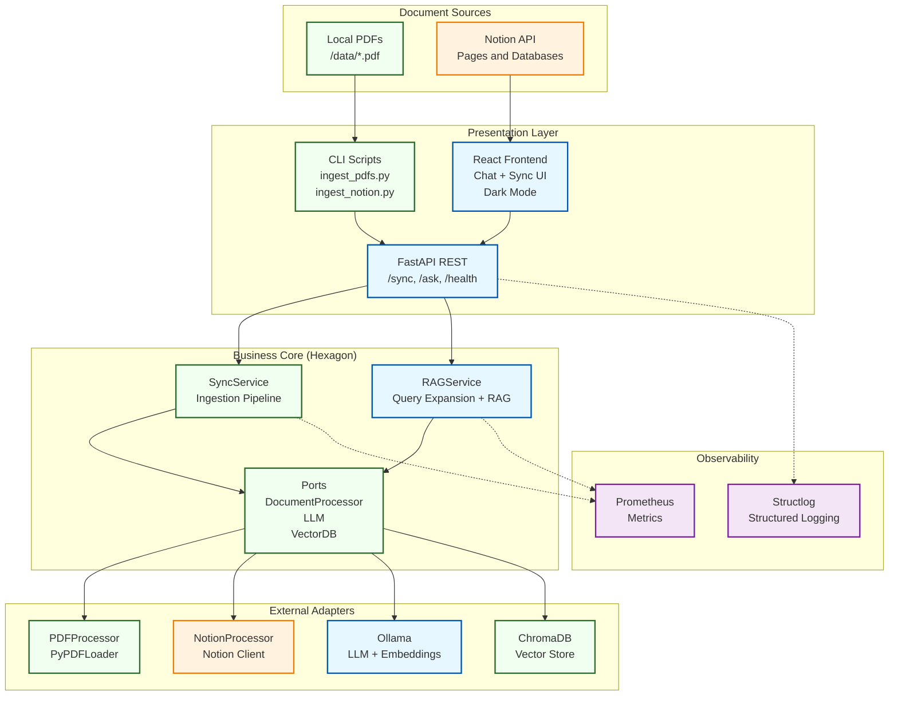
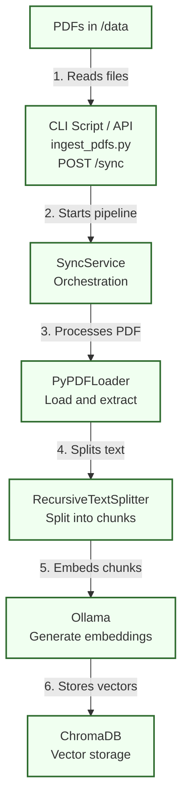
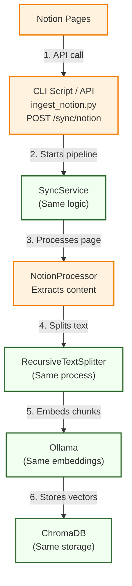
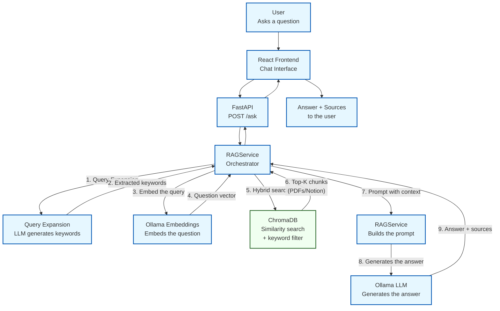
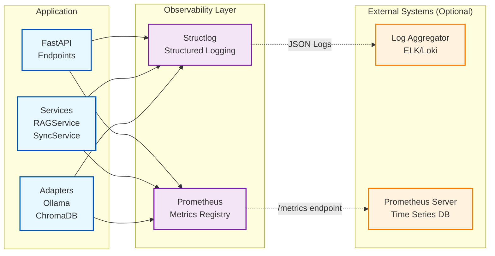

# 🤖 AIbrarian


A multi-user RAG assistant ("AIbrarian") for querying private documents (PDFs and Notion), with a local (Ollama) or cloud (Groq) LLM, JWT authentication, and hexagonal architecture.

---

## 📖 Project Description

**AIbrarian** is a full end-to-end RAG (Retrieval-Augmented Generation) system, built with a focus on privacy and a decoupled software architecture.

The goal is a *chatbot* able to answer questions over a private knowledge base (local PDFs and **Notion** pages). Thanks to the **Hexagonal Architecture**, the LLM and the vector store are swappable without touching business logic: a 100% local mode (**Ollama** + ChromaDB) where sensitive data never leaves the machine, and an optional cloud mode (**Groq** + Chroma Cloud) for deploying on Render without depending on local hardware.

Access is protected by **multi-user JWT authentication** (token sent in the `Authorization` header, no public signup — users are created via CLI), needed to expose the system outside `localhost` without leaving it open to anyone.

---

## ✨ Main Features

### 🔄 Multi-source Ingestion
- **Local PDFs**: browser upload with drag & drop, or bulk sync via CLI
- **Notion API**: sync of individual pages and full databases
- **Automatic Extraction**: Notion database properties (title, rich_text, number, select, etc.)
- **Robust Title Detection**: identifies a Notion page's title property by its `type`, not by column name — works with any database schema, not just the column name used during original development
- **Resilient Sync**: when syncing a full Notion database, a single page failing (timeout, embedding-backend error, etc.) doesn't abort the rest — it's logged as an isolated failure and the sync continues with the remaining pages

### 🧠 Advanced RAG System
- **Hybrid Search**: semantic search combined with extracted keywords (Query Expansion, a custom implementation)
- **Relevance Filtering**: a minimum similarity threshold (`min_relevance_score`) — discards low-relevance chunks before generation, instead of forcing the LLM to answer with irrelevant context
- **Swappable LLM**: local Ollama (`llama3.2`, total privacy) or cloud Groq (`openai/gpt-oss-120b`, for deployments with no local GPU) — same code, chosen via an environment variable
- **Streaming Responses**: Server-Sent Events (`POST /ask/stream`) — the answer is shown token by token instead of waiting for the full response
- **Conversation History**: context across questions (Postgres), enabling follow-up questions ("can you expand on that?")
- **Query Rewriting**: a short follow-up question with no proper nouns ("how many pages does it have?", right after discussing a book) is first rewritten as a self-contained question using the history ("how many pages does *that book* have?") before searching — same pattern as LangChain's `create_history_aware_retriever`. Without this, that kind of question either found nothing relevant or (worse) found a chunk from a different document with a high enough score to slip in a confident but wrong answer
- **Contextualized Answers**: citations referencing source documents
- **Prompt Engineering**: strict instructions to prevent hallucinations
- **Catalog Questions, Without Hallucinating**: questions like "how many documents do you know about?" aren't resolved with top-k semantic search (which can never guarantee covering the whole catalog) — an LLM classifies the question's intent (language-independent) and, if it's an aggregate question, the answer is built by listing the actual catalog via metadata, not by generating text
- **Quality Evaluation**: a RAGAS harness (faithfulness, answer relevancy, context precision) against a reference dataset — `pytest -m eval`

### 🎨 User Interface
- **Conversational Chat**: an intuitive interface with conversation history
- **Sync Panel**: visual document management with real-time statistics
- **Document Browser**: a searchable list of everything indexed (title, source, chunk count) with direct deletion, without depending on the chat correctly answering "what do you have indexed"-style questions
- **Dark Mode**: modern design with Tailwind CSS v4
- **Responsive**: works on mobile and desktop

### 🔐 Authentication and Security
- **Multi-user via JWT**: 24h session, token in localStorage sent as an `Authorization: Bearer` header (not a cookie — avoids Safari ITP blocking cross-site cookies when the frontend and API live on different domains)
- **CLI User Creation**: no public signup — `scripts/create_user.py`, password via `getpass`
- **Protected Endpoints**: everything except the public healthchecks the deployment needs
- **Postgres Persistence**: Neon in production, a local container in development (`docker-compose`)

### 📊 Full Observability
- **Structured Logging**: Structlog with JSON output for automatic parsing
- **Prometheus Metrics**: 8+ key metrics (latencies, requests, LLM operations)
- **Health Checks**: monitors the status of the API, Ollama, and ChromaDB
- **/metrics Endpoint**: exposes metrics for scraping

### 🧪 Testing
- **148 Unit Tests**: Pytest with 65% coverage (measured, see the Future Work note on where coverage is thin)
- **Integration Tests**: end-to-end against real services
- **Configured Mocks**: for Ollama, ChromaDB, Postgres, and the processors
- **CI**: GitHub Actions runs the `unit` suite on every push/PR (backend; see Future Work regarding the frontend)

### 🏗️ Quality Architecture
- **Hexagonal Pattern**: a clean separation between domain, ports, and adapters
- **Documented Code**: docstrings with detailed explanations
- **Conventional Commits**: a clean, semantic git history
- **Flexible Configuration**: environment variables for different deployment modes

## 🛠️ Tech Stack

* **Backend Framework:** **Python** with **FastAPI**
* **Document Loading & Chunking:** **LangChain** (`PyPDFLoader`, `NotionDBLoader`, `RecursiveCharacterTextSplitter`) — the RAG pipeline's orchestration (Query Expansion, hybrid search, prompting) is a custom implementation, not LangChain's
* **Language Model (LLM):** **Ollama** (`llama3.2`, local) or **Groq** (`openai/gpt-oss-120b`, cloud) — swappable via configuration, see [ADR-007](docs/adr/007-cloud-deployment-groq-chroma.md)
* **Vector Database:** **ChromaDB** (local via Docker) or **Chroma Cloud** (managed)
* **Data Sources:** **local PDFs** and the **Notion API**
* **Frontend:** **React 19** + **Vite 7** + **Tailwind CSS v4** (Dark Mode)
* **Authentication:** **JWT** + **Postgres** (Neon in production)
* **Observability:** **Structlog** + **Prometheus**
* **Containerization:** **Docker Compose** (ChromaDB + Postgres + API)
* **Cloud deployment (optional):** **Render** + **Groq** + **Chroma Cloud** — see [ADR-007](docs/adr/007-cloud-deployment-groq-chroma.md) and the [deployment guide](docs/DEPLOYMENT.md). Local development (Ollama + ChromaDB) remains the default `docker-compose up` flow.

---

## 🏛️ System Architecture

The project follows a **Hexagonal Architecture (Ports and Adapters)** pattern and was built in incremental phases:

* **MVP (green):** local PDF ingestion pipeline - guarantees the system's core functionality
* **Phase 1 (blue):** full RAG system for queries - the AI chatbot with a React frontend
* **Extension (orange):** Notion API integration - added value and differentiation



> This diagram reflects the project's original build-out phases (MVP → Phase 1 → Notion extension). Authentication (JWT + Postgres) and the cloud mode (Groq + Chroma Cloud) were added afterward as a cross-cutting layer — see the Authentication and Security section and [ADR-007](docs/adr/007-cloud-deployment-groq-chroma.md).

---

## 🔄 Workflows by Phase

The system implements ingestion and query flows that show the hexagonal architecture in action.

### **MVP: Local PDF Ingestion**
A simple, robust ingestion pipeline. Guarantees the system's core functionality with no external dependencies. (Green.)



### **Extension: Notion Integration**
Same pipeline, different adapter. Shows the hexagonal architecture's flexibility. (Orange.)



### **Phase 1: RAG System (Chatbot)**
The intelligent chatbot with Query Expansion that answers questions using the indexed knowledge base. (Blue.)



---

## 🔍 Observability

The system includes a **full observability layer** for production monitoring:

### **Structured Logging** (Structlog)
- JSON-formatted logs for easy parsing
- Enriched context (request_id, user_id, timestamps)
- Configurable log levels per module

### **Metrics** (Prometheus)
- `vector_search_latency_seconds`: vector search latency
- `llm_generation_time_seconds`: LLM generation time
- `documents_synced_total`: counter of processed documents
- `/metrics` endpoint for scraping

> No distributed tracing (OpenTelemetry/Jaeger) is implemented — only structured logging and metrics. Left as a possible future addition (see Future Work).

**Observability Architecture:**



**Usage example:**
```python
# Structured logs are generated automatically
logger.info("Query processed",
           query=query,
           results_count=len(sources),
           latency=duration)

# Metrics are recorded automatically
VECTOR_SEARCH_LATENCY.observe(duration)
```

---

## 📚 Documentation

| Document | Description |
|-----------|-------------|
| **[docs/STRUCTURE.md](docs/STRUCTURE.md)** | Project architecture and structure |
| **[docs/USAGE.md](docs/USAGE.md)** | API endpoints and CLI scripts |
| **[docs/USAGE_TESTING.md](docs/USAGE_TESTING.md)** | Test suite and testing guide |
| **[docs/adr/INDEX.md](docs/adr/INDEX.md)** | Architecture decisions (ADRs) |
| **[docs/DEPLOYMENT.md](docs/DEPLOYMENT.md)** | Optional deployment on Render (Groq + Chroma Cloud) |

---

## 🚀 Quick Start

### Prerequisites

1. **macOS** (with Apple Silicon for the Metal GPU)
2. **Python 3.11+**
3. **Docker Desktop** (for ChromaDB and Postgres, the latter used for authentication)
4. **Node.js 18+** (for the frontend)

### Installation

**Option 1: Automated Installation (Recommended)**

```bash
# 1. Clone the repository
git clone <REPO_URL>
cd aibrarian

# 2. Run the setup script
python3 scripts/setup.py
```

The `setup.py` script automatically configures:
- Native Ollama (takes advantage of the Metal GPU, ~10x faster)
- ChromaDB in Docker
- A Python environment with dependencies
- The frontend with npm

> ⚠️ `setup.py` doesn't create the first login user yet (authentication was added later). Whether you use the automated or the manual install, you still need the "Create your user" step below before you can log in to the chat.

**Option 2: Manual Installation**

```bash
# 1. Clone the repository
git clone <REPO_URL>
cd aibrarian

# 2. Install Ollama and pull the models
brew install ollama
ollama pull llama3.2
ollama pull nomic-embed-text

# 3. Python setup
cd api
python -m venv venv
source venv/bin/activate
pip install -r requirements.txt
cp .env.example .env
# Generate a real secret for JWT_SECRET_KEY (the one in .env.example is a placeholder):
python -c "import secrets; print(secrets.token_hex(32))"
# ...and paste it into JWT_SECRET_KEY inside api/.env

# 4. Start ChromaDB and Postgres
cd ..
docker-compose up -d chromadb postgres

# 5. Frontend setup
cd frontend
npm install

# 6. Verify the setup
python scripts/verify_setup.py
```

### Create Your User

There's no public signup — the login is created via CLI (password via `getpass`, never saved in the shell history):

```bash
source api/venv/bin/activate
python scripts/create_user.py --email you@email.com
```

### Usage

```bash
# Terminal 1: Ollama (keep it open)
ollama serve

# Terminal 2: Docker (ChromaDB + Postgres + API)
docker-compose up -d

# Terminal 3: Frontend
cd frontend && npm run dev

# Open your browser at http://localhost:5173 and log in with the user created above
```

**Ports:**
- Frontend: http://localhost:5173
- API: http://localhost:8000 (API Docs: http://localhost:8000/docs)
- ChromaDB: http://localhost:8001
- Postgres: localhost:5432

---

## ⚠️ Known Limitations

- **macOS only (local development)**: the native-Ollama setup is optimized for macOS with Apple Silicon (Metal GPU). The cloud mode (Groq + Chroma Cloud, see deployment) doesn't have this limitation
- **Local models**: llama3.2's (3B parameters) answer quality is lower than cloud models like GPT-4, but sufficient for the use case and guarantees full privacy
- **Scalability**: ChromaDB in standalone mode doesn't scale horizontally. Fine for thousands of documents, not millions

## 🔮 Future Work

- **Frontend tests**: there are no automated tests in `frontend/` yet (neither Vitest nor Testing Library are configured) — add coverage for at least the auth and chat components
- **Frontend CI**: the current workflow (`.github/workflows/api_tests.yml`) only runs `pytest -m unit`; add `npm run build` and `npm run lint` to catch frontend breakage on every PR
- **Raise backend test coverage**: 65% overall, but concentrated in the *services* (mocked); the adapters that talk to real services are poorly covered
- **Distributed tracing**: no OpenTelemetry/Jaeger implemented, only structured logging and metrics (see Observability)
- **Detect the API running twice at once** (Docker's `docker-compose up -d` and a native `uvicorn --reload`): easy to hit during active development, and it makes changes to `api/.env` look like they aren't applying (the old container answers, not the restarted process). `scripts/verify_setup.py` doesn't catch this today.
- **Refactor `ingest_notion.py`**: its `--database` mode hand-reimplements the embedding/storage pipeline instead of reusing `SyncService.sync_document_from_file()` (which the `--page` mode does use) — this avoids re-fetching every page from the Notion API, but duplicates logic that should only live in one place.

---

## 📄 License

This project is licensed under the MIT License. See [LICENSE](LICENSE) for details.

---
