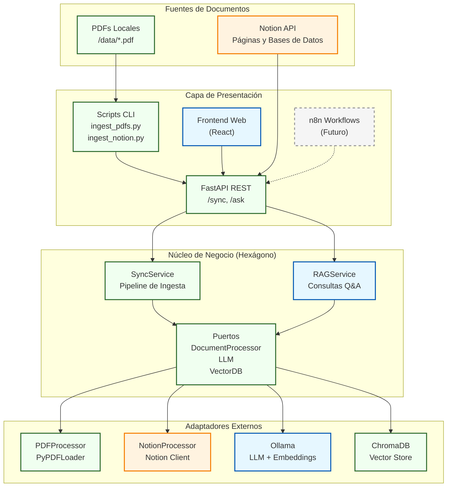
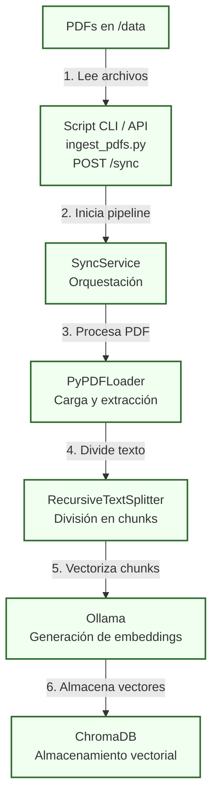
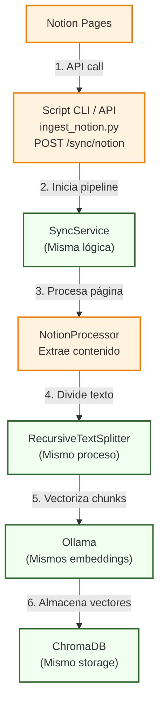
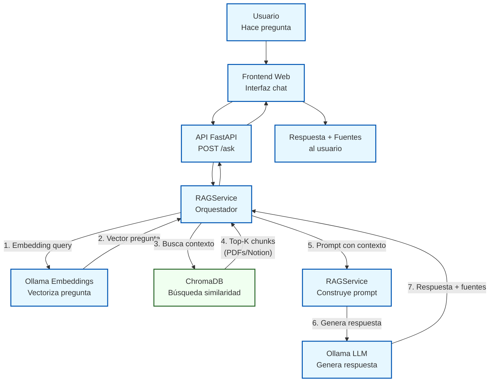

# 🤖 tfm-bibliotecario-ia


TFM que implementa un asistente RAG ('Bibliotecario IA') para consultar documentos de Notion usando Ollama y LangChain, con sincronización automática vía n8n.

---

## 📖 Descripción del Proyecto

**`bibliotecario-ia`** es un Trabajo Final de Máster que demuestra la implementación de un sistema RAG (Retrieval-Augmented Generation) de principio a fin, enfocado en la privacidad y la arquitectura de software desacoplada.

El objetivo es crear un *chatbot* capaz de responder preguntas sobre una base de conocimiento privada (alojada en **Notion**) utilizando un modelo de lenguaje que se ejecuta localmente (**Ollama**). Esto garantiza que los datos sensibles nunca abandonen la máquina local.

El sistema se construye sobre una **Arquitectura Hexagonal** para asegurar que los componentes (API, lógica de IA, bases de datos) estén desacoplados y sean fáciles de mantener o sustituir.

## 🛠️ Stack Tecnológico

* **Framework Backend:** **Python** con **FastAPI**
* **Orquestación de IA:** **LangChain**
* **Modelo de Lenguaje (LLM):** **Ollama** (ej. `llama3` o `mistral`)
* **Base de Datos Vectorial:** **ChromaDB**
* **Fuente de Datos:** **Notion API**
* **Automatización / Sincronización:** **n8n** (self-hosted)
* **Contenerización:** **Docker Compose**

---

## 🏛️ Arquitectura del Sistema

El proyecto sigue un patrón de **Arquitectura Hexagonal (Puertos y Adaptadores)** y se desarrolla en fases incrementales:

* **MVP (Verde):** Pipeline de ingesta de PDFs locales - Garantiza funcionalidad básica del TFM
* **Fase 1 (Azul):** Sistema RAG completo para consultas - El chatbot IA
* **Extensión (Naranja):** Integración con Notion API - Valor añadido y diferenciación
* **Futuro (Gris):** Automatización con n8n y notificaciones - Mejoras opcionales


---

## 🔄 Flujos de Trabajo por Fases

El sistema implementa flujos de ingesta y consulta que demuestran la arquitectura hexagonal en acción.

### **MVP: Ingesta de PDFs Locales**
Pipeline de ingesta simple y robusto. Garantiza funcionalidad core del sistema sin dependencias externas. (Verde).



### **Extensión: Integración con Notion**
Mismo pipeline, diferente adaptador. Demuestra la flexibilidad de la arquitectura hexagonal. (Naranja).



### **Fase 1: Sistema RAG (Chatbot)**
El chatbot inteligente que responde preguntas usando la base de conocimientos indexada. (Azul).



### **Futuro: Automatización con n8n**
Mejoras opcionales para automatizar sincronización y notificaciones. (Gris - No implementado).

**Posibles extensiones:**
- Workflow n8n que detecte cambios en Notion y sincronice automáticamente
- Notificaciones por email cuando se añaden nuevos documentos
- Webhooks para integración con otros sistemas
- Sincronización programada (cron jobs)

Estas mejoras quedan documentadas como evolución natural del proyecto, pero no son necesarias para demostrar el valor del TFM.

---

## 📚 Documentación

| Documento | Descripción |
|-----------|-------------|
| **[docs/STRUCTURE.md](docs/STRUCTURE.md)** | Arquitectura y estructura del proyecto |
| **[docs/USAGE.md](docs/USAGE.md)** | API endpoints y ejemplos |
| **[docs/PYTHON_GUIDE.md](docs/PYTHON_GUIDE.md)** | Guía de Python para JS devs |
| **[.ai/context.md](.ai/context.md)** | Contexto para agentes IA |

---

## 🚀 Quick Start

### Prerequisitos

1. **Python 3.11+**
2. **Docker** (para ChromaDB)
3. **Ollama** instalado localmente

### Instalación

```bash
# 1. Clonar repositorio
git clone <URL_DEL_REPO>
cd tfm-bibliotecario-ia

# 2. Instalar Ollama y descargar modelos
brew install ollama  # macOS
ollama pull llama3.2
ollama pull nomic-embed-text

# 3. Setup Python
cd api
python -m venv venv
source venv/bin/activate  # macOS/Linux
pip install -r requirements.txt

# 4. Configurar variables de entorno
cp .env.example .env
# Editar .env con tus valores

# 5. Iniciar ChromaDB
cd ..
docker-compose up -d chromadb

# 6. Verificar setup
cd api
python verify_setup.py
```

### Uso Básico

```bash
# Terminal 1: Ollama
ollama serve

# Terminal 2: API
cd api && source venv/bin/activate
uvicorn app.main:app --reload

# Terminal 3: Ingestar documentos
python api/ingest_pdfs.py --directory data/

# Terminal 4: Hacer consultas
curl -X POST http://localhost:8000/ask \
  -H "Content-Type: application/json" \
  -d '{"question": "¿De qué tratan los documentos?"}'
```

Ver [docs/USAGE.md](docs/USAGE.md) para documentación completa de la API.

---

## 📄 Licencia

Este proyecto está bajo la licencia MIT. Ver [LICENSE](LICENSE) para más detalles.

---

**Proyecto:** TFM Bibliotecario-IA
**Arquitectura:** Hexagonal (Puertos y Adaptadores)
**Stack:** Python + FastAPI + LangChain + Ollama + ChromaDB
