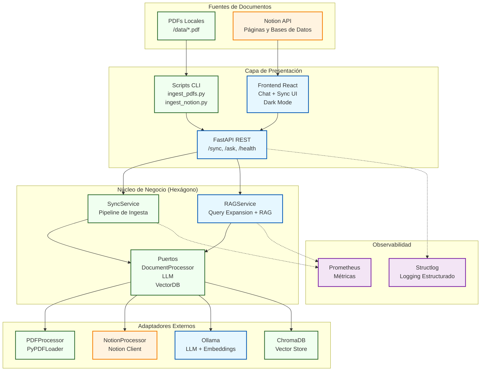
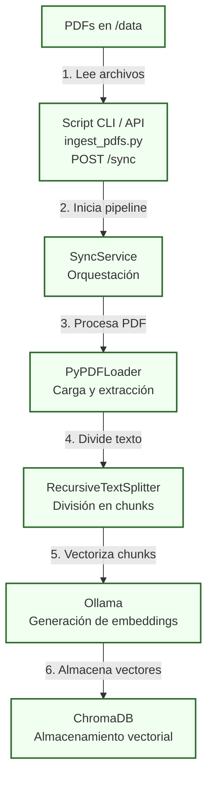
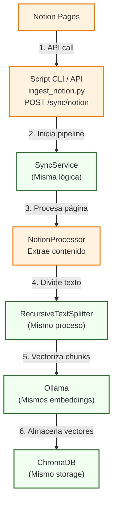
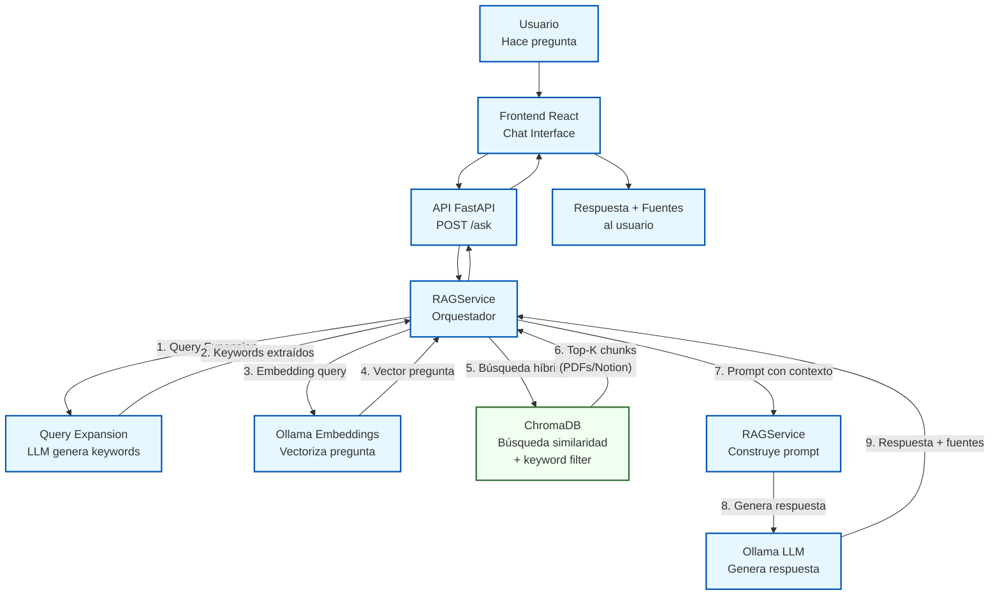

# 🤖 tfm-bibliotecario-ia


TFM que implementa un asistente RAG multiusuario ('Bibliotecario IA') para consultar documentos privados (PDFs y Notion), con LLM local (Ollama) o cloud (Groq), autenticación JWT y arquitectura hexagonal.

---

## 📖 Descripción del Proyecto

**`bibliotecario-ia`** es un Trabajo Final de Máster que demuestra la implementación de un sistema RAG (Retrieval-Augmented Generation) de principio a fin, enfocado en la privacidad y la arquitectura de software desacoplada.

El objetivo es crear un *chatbot* capaz de responder preguntas sobre una base de conocimiento privada (PDFs locales y páginas de **Notion**). Gracias a la **Arquitectura Hexagonal**, el LLM y la base vectorial son intercambiables sin tocar la lógica de negocio: un modo 100% local (**Ollama** + ChromaDB) donde los datos sensibles nunca abandonan la máquina, y un modo cloud opcional (**Groq** + Chroma Cloud) para desplegar en Render sin depender de hardware local.

El acceso está protegido con **autenticación JWT multiusuario** (token enviado en el header `Authorization`, sin registro público — los usuarios se dan de alta por CLI), necesaria para poder exponer el sistema fuera de `localhost` sin dejarlo abierto a cualquiera.

---

## ✨ Funcionalidades Principales

### 🔄 Ingesta Multi-fuente
- **PDFs Locales**: Upload desde navegador con drag & drop o sincronización masiva vía CLI
- **Notion API**: Sincronización de páginas individuales y bases de datos completas
- **Extracción Automática**: Propiedades de bases de datos Notion (title, rich_text, number, select, etc.)

### 🧠 Sistema RAG Avanzado
- **Búsqueda Híbrida**: Combinación de búsqueda semántica + keywords extraídos (Query Expansion, implementación propia)
- **LLM Intercambiable**: Ollama local (`llama3.2`, privacidad total) o Groq cloud (`openai/gpt-oss-120b`, para despliegues sin GPU local) — mismo código, se elige por variable de entorno
- **Respuestas Contextualizadas**: Citas con referencias a documentos fuente
- **Prompt Engineering**: Instrucciones estrictas para evitar alucinaciones

### 🎨 Interfaz de Usuario
- **Chat Conversacional**: Interfaz intuitiva con historial de conversación
- **Panel de Sincronización**: Gestión visual de documentos con estadísticas en tiempo real
- **Dark Mode**: Diseño moderno con Tailwind CSS v4
- **Responsive**: Adaptable a móvil y desktop

### 🔐 Autenticación y Seguridad
- **Multiusuario vía JWT**: sesión de 24h, token en localStorage enviado como header `Authorization: Bearer` (no cookie — evita el bloqueo de cookies cross-site del ITP de Safari cuando frontend y API viven en dominios distintos)
- **Alta de usuarios por CLI**: sin registro público — `scripts/create_user.py`, contraseña vía `getpass`
- **Endpoints protegidos**: todos salvo los healthchecks públicos requeridos por el despliegue
- **Persistencia en Postgres**: Neon en producción, contenedor local en desarrollo (`docker-compose`)

### 📊 Observabilidad Integral
- **Logging Estructurado**: Structlog con formato JSON para parsing automático
- **Métricas Prometheus**: 8+ métricas clave (latencias, requests, operaciones LLM)
- **Health Checks**: Monitoreo de estado de API, Ollama y ChromaDB
- **Endpoint /metrics**: Exposición de métricas para scraping

### 🧪 Testing
- **90 Tests Unitarios**: Pytest con 62% de cobertura (medido, ver nota en Trabajo Futuro sobre dónde falta cobertura)
- **Tests de Integración**: End-to-end con servicios reales
- **Mocks Configurados**: Para Ollama, ChromaDB, Postgres y procesadores
- **CI**: GitHub Actions ejecuta la suite `unit` en cada push/PR (backend; ver Trabajo Futuro sobre frontend)

### 🏗️ Arquitectura de Calidad
- **Patrón Hexagonal**: Separación clara entre dominio, puertos y adaptadores
- **Código Documentado**: Docstrings en español con explicaciones detalladas
- **Conventional Commits**: Historial de git limpio y semántico
- **Configuración Flexible**: Variables de entorno para diferentes modos de deployment

## 🛠️ Stack Tecnológico

* **Framework Backend:** **Python** con **FastAPI**
* **Carga y Chunking de Documentos:** **LangChain** (`PyPDFLoader`, `NotionDBLoader`, `RecursiveCharacterTextSplitter`) — la orquestación del pipeline RAG (Query Expansion, búsqueda híbrida, prompting) es implementación propia, no de LangChain
* **Modelo de Lenguaje (LLM):** **Ollama** (`llama3.2`, local) o **Groq** (`openai/gpt-oss-120b`, cloud) — intercambiables por configuración, ver [ADR-007](docs/adr/007-despliegue-cloud-groq-chroma.md)
* **Base de Datos Vectorial:** **ChromaDB** (local vía Docker) o **Chroma Cloud** (gestionado)
* **Fuentes de Datos:** **PDFs locales** y **Notion API**
* **Frontend:** **React 19** + **Vite 7** + **Tailwind CSS v4** (Dark Mode)
* **Autenticación:** **JWT** + **Postgres** (Neon en producción)
* **Observabilidad:** **Structlog** + **Prometheus**
* **Contenerización:** **Docker Compose** (ChromaDB + Postgres + API)
* **Despliegue cloud (opcional):** **Render** + **Groq** + **Chroma Cloud** — ver [ADR-007](docs/adr/007-despliegue-cloud-groq-chroma.md) y [guía de despliegue](docs/DEPLOYMENT.md). El desarrollo local (Ollama + ChromaDB) sigue siendo el flujo por defecto de `docker-compose up`.

---

## 🎥 Demo en Video

### Demostración del sistema

**[▶️ Ver Video Demo en Google Drive](https://drive.google.com/file/d/1nTfRfqYPkvdErhMkXMwcC0Q9M0WI8ksv/view?usp=sharing)**

**Funcionalidades mostradas:**
El video muestra el sistema funcionando con una base de conocimiento real:
- ✅ **Base de datos:** ~1900 documentos del curso ya indexados
- ✅ **Consultas en tiempo real:** Búsqueda semántica sobre miles de chunks
- ✅ **Respuestas contextualizadas:** Citas precisas a documentos fuente
- ✅ **Panel de estadísticas:** Monitoreo del estado del sistema
- ✅ **Sincronización de Notion:** Ingesta de páginas desde Notion API

---

## 🏛️ Arquitectura del Sistema

El proyecto sigue un patrón de **Arquitectura Hexagonal (Puertos y Adaptadores)** y se desarrolla en fases incrementales:

* **MVP (Verde):** Pipeline de ingesta de PDFs locales - Garantiza funcionalidad básica del TFM
* **Fase 1 (Azul):** Sistema RAG completo para consultas - El chatbot IA con frontend React
* **Extensión (Naranja):** Integración con Notion API - Valor añadido y diferenciación



> Este diagrama refleja las fases originales del TFM (MVP → Fase 1 → Extensión Notion). La autenticación (JWT + Postgres) y el modo cloud (Groq + Chroma Cloud) se añadieron después como una capa transversal — ver la sección de Autenticación y Seguridad y [ADR-007](docs/adr/007-despliegue-cloud-groq-chroma.md).

---

## 🔄 Flujos de Trabajo por Fases

El sistema implementa flujos de ingesta y consulta que demuestran la arquitectura hexagonal en acción.

### **MVP: Ingesta de PDFs Locales**
Pipeline de ingesta simple y robusto. Garantiza funcionalidad core del sistema sin dependencias externas. (Verde).



### **Extensión: Integración con Notion**
Mismo pipeline, diferente adaptador. Demuestra la flexibilidad de la arquitectura hexagonal. (Naranja).



### **Fase 1: Sistema RAG (Chatbot)**
El chatbot inteligente con Query Expansion que responde preguntas usando la base de conocimientos indexada. (Azul).



---

## 🔍 Observabilidad

El sistema incluye una **capa completa de observabilidad** para monitoreo en producción:

### **Logging Estructurado** (Structlog)
- Logs en formato JSON para fácil parsing
- Contexto enriquecido (request_id, user_id, timestamps)
- Niveles configurables por módulo

### **Métricas** (Prometheus)
- `vector_search_latency_seconds`: Latencia de búsquedas vectoriales
- `llm_generation_time_seconds`: Tiempo de generación del LLM
- `documents_synced_total`: Contador de documentos procesados
- Endpoint `/metrics` para scraping

> No hay tracing distribuido (OpenTelemetry/Jaeger) implementado — solo logging estructurado y métricas. Queda como posible ampliación (ver Trabajo Futuro).

**Arquitectura de Observabilidad:**


**Ejemplo de uso:**
```python
# Los logs estructurados se generan automáticamente
logger.info("Query processed",
           query=query,
           results_count=len(sources),
           latency=duration)

# Las métricas se registran automáticamente
VECTOR_SEARCH_LATENCY.observe(duration)
```

---

## 📚 Documentación

| Documento | Descripción |
|-----------|-------------|
| **[docs/Bibliotecario-IA_Presentacion_TFM.pptx](docs/Bibliotecario-IA_Presentacion_TFM.pptx)** | Slides de presentación del proyecto |
| **[docs/STRUCTURE.md](docs/STRUCTURE.md)** | Arquitectura y estructura del proyecto |
| **[docs/USAGE.md](docs/USAGE.md)** | API endpoints y scripts CLI |
| **[docs/USAGE_TESTING.md](docs/USAGE_TESTING.md)** | Suite de tests y guía de testing |
| **[docs/adr/INDEX.md](docs/adr/INDEX.md)** | Decisiones arquitectónicas (ADRs) |
| **[docs/DEPLOYMENT.md](docs/DEPLOYMENT.md)** | Despliegue opcional en Render (Groq + Chroma Cloud) |
| **[.ai/context.md](.ai/context.md)** | Contexto para agentes IA |
| **[.ai/evaluation.md](.ai/evaluation.md)** | Contexto sobre los criterios de evaluacion del TFM para agentes IA |

---

## 🚀 Quick Start

### Prerequisitos

1. **macOS** (con Apple Silicon para GPU Metal)
2. **Python 3.11+**
3. **Docker Desktop** (para ChromaDB y Postgres, usado para la autenticación)
4. **Node.js 18+** (para el frontend)

### Instalación

**Opción 1: Instalación Automática (Recomendada)**

```bash
# 1. Clonar repositorio
git clone <URL_DEL_REPO>
cd tfm-bibliotecario-ia

# 2. Ejecutar script de instalación
python3 scripts/setup.py
```

El script `setup.py` configura automáticamente:
- Ollama nativo (aprovecha GPU Metal, ~10x más rápido)
- ChromaDB en Docker
- Entorno Python con dependencias
- Frontend con npm

> ⚠️ `setup.py` todavía no crea el primer usuario de login (la autenticación se añadió después). Tanto si usas la instalación automática como la manual, hace falta el paso "Crear tu usuario" de más abajo antes de poder entrar al chat.

**Opción 2: Instalación Manual**

```bash
# 1. Clonar repositorio
git clone <URL_DEL_REPO>
cd tfm-bibliotecario-ia

# 2. Instalar Ollama y descargar modelos
brew install ollama
ollama pull llama3.2
ollama pull nomic-embed-text

# 3. Setup Python
cd api
python -m venv venv
source venv/bin/activate
pip install -r requirements.txt
cp .env.example .env
# Genera un secreto real para JWT_SECRET_KEY (el de .env.example es un placeholder):
python -c "import secrets; print(secrets.token_hex(32))"
# ...y pégalo en JWT_SECRET_KEY dentro de api/.env

# 4. Iniciar ChromaDB y Postgres
cd ..
docker-compose up -d chromadb postgres

# 5. Setup Frontend
cd frontend
npm install

# 6. Verificar setup
python scripts/verify_setup.py
```

### Crear tu usuario

No hay registro público — el login se crea por CLI (contraseña vía `getpass`, no se guarda en el historial de la shell):

```bash
source api/venv/bin/activate
python scripts/create_user.py --email tu@email.com
```

### Uso

```bash
# Terminal 1: Ollama (mantener abierto)
ollama serve

# Terminal 2: Docker (ChromaDB + Postgres + API)
docker-compose up -d

# Terminal 3: Frontend
cd frontend && npm run dev

# Abrir navegador en http://localhost:5173 e iniciar sesión con el usuario creado arriba
```

**Puertos:**
- Frontend: http://localhost:5173
- API: http://localhost:8000 (API Docs: http://localhost:8000/docs)
- ChromaDB: http://localhost:8001
- Postgres: localhost:5432

---

## ⚠️ Limitaciones Conocidas

- **Solo macOS (desarrollo local)**: El entorno con Ollama nativo está optimizado para macOS con Apple Silicon (GPU Metal). El modo cloud (Groq + Chroma Cloud, ver despliegue) no tiene esta limitación
- **Modelos locales**: La calidad de las respuestas de llama3.2 (3B parámetros) es inferior a modelos cloud como GPT-4, pero suficiente para el caso de uso y garantiza privacidad total
- **Cookies de sesión y navegadores**: si despliegas frontend y API en subdominios `.onrender.com` distintos (lo normal si no configuras un dominio propio), Safari y otros navegadores con bloqueo de cookies de terceros activado por defecto descartan la cookie de sesión — el login "parece" funcionar pero las peticiones protegidas posteriores dan 401. Se soluciona sirviendo frontend y API bajo el mismo dominio raíz (pendiente, ver Trabajo Futuro)
- **Escalabilidad**: ChromaDB en modo standalone no escala horizontalmente. Adecuado para miles de documentos, no para millones

## 🔮 Trabajo Futuro

- **Streaming de respuestas**: Implementar Server-Sent Events (SSE) para mostrar la respuesta del LLM token a token en tiempo real
- **Historial de conversación**: Mantener contexto entre preguntas para permitir preguntas de seguimiento ("¿puedes ampliar eso?")
- **Más fuentes de datos**: Integrar Google Drive, Confluence, o páginas web como fuentes adicionales de documentos
- **Evaluación del RAG**: Implementar métricas de calidad (faithfulness, relevance) con frameworks como RAGAS
- **Soporte multi-plataforma**: Adaptar scripts de instalación para Linux y Windows (WSL)
- **Dominio propio**: mover frontend/API al mismo dominio raíz (p. ej. `app.dominio.com` + `api.dominio.com`) para que la cookie de sesión funcione en todos los navegadores, incluido Safari (ver Limitaciones Conocidas)
- **Tests de frontend**: no hay ningún test automatizado en `frontend/` todavía (ni Vitest ni Testing Library configurados) — añadir cobertura al menos de los componentes de auth y chat
- **CI de frontend**: el workflow actual (`.github/workflows/test.yml`) solo corre `pytest -m unit`; añadir `npm run build` y `npm run lint` para detectar roturas del frontend en cada PR
- **Subir cobertura de tests del backend**: 62% global, pero concentrado en los *services* (mockeados); los adapters que hablan con servicios reales están poco cubiertos (Notion 29%, PDF 34%, Postgres 35%, ChromaDB 46%)
- **Rate limiting en `/auth/login`**: no hay throttling — aceptable para un demo personal, pero necesario antes de invitar tráfico público a probarlo
- **Resolver alertas de Dependabot**: el repo tiene vulnerabilidades de dependencias señaladas por GitHub (varias críticas/altas) pendientes de revisar y actualizar
- **Tracing distribuido**: no hay OpenTelemetry/Jaeger implementado, solo logging estructurado y métricas (ver Observabilidad)

---

## 📄 Licencia

Este proyecto está bajo la licencia MIT. Ver [LICENSE](LICENSE) para más detalles.

---
