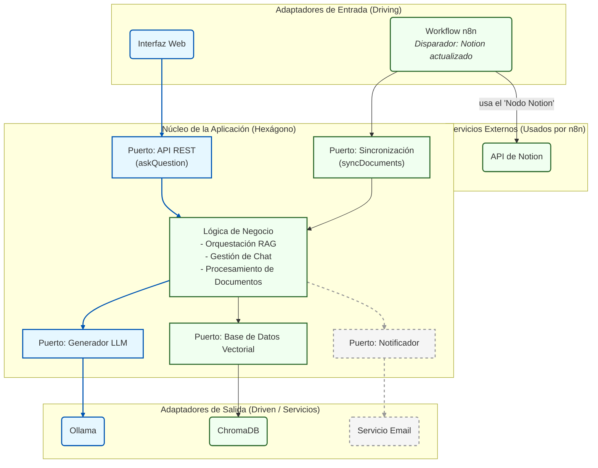
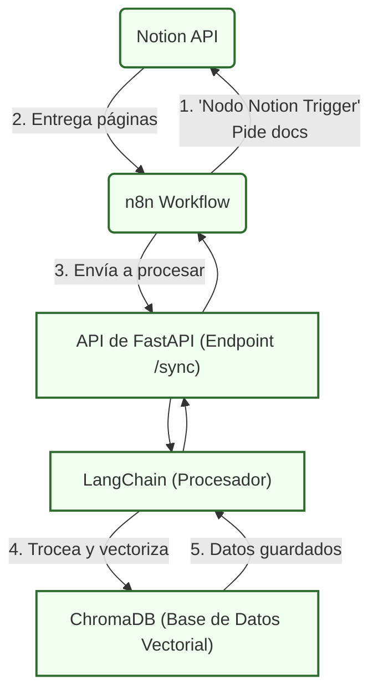
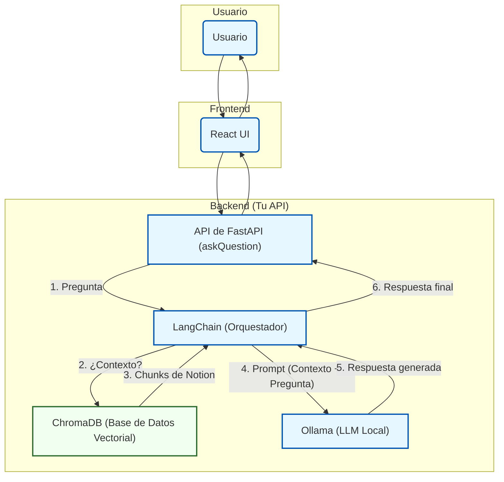
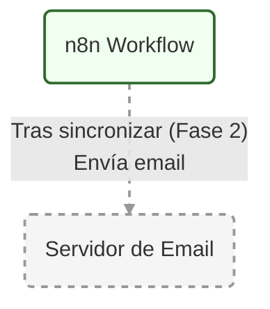

# 🤖 tfm-bibliotecario-ia

TFM que implementa un asistente RAG ('Bibliotecario IA') para consultar documentos de Notion usando Ollama y LangChain, con sincronización automática vía n8n.

---

## 📖 Descripción del Proyecto

**`bibliotecario-ia`** es un Trabajo Final de Máster que demuestra la implementación de un sistema RAG (Retrieval-Augmented Generation) de principio a fin, enfocado en la privacidad y la arquitectura de software desacoplada.

El objetivo es crear un *chatbot* capaz de responder preguntas sobre una base de conocimiento privada (alojada en **Notion**) utilizando un modelo de lenguaje que se ejecuta localmente (**Ollama**). Esto garantiza que los datos sensibles nunca abandonen la máquina local.

El sistema se construye sobre una **Arquitectura Hexagonal** para asegurar que los componentes (API, lógica de IA, bases de datos) estén desacoplados y sean fáciles de mantener o sustituir.

## 🛠️ Stack Tecnológico

* **Framework Backend:** **Python** con **FastAPI**
* **Orquestación de IA:** **LangChain**
* **Modelo de Lenguaje (LLM):** **Ollama** (ej. `llama3` o `mistral`)
* **Base de Datos Vectorial:** **ChromaDB**
* **Fuente de Datos:** **Notion API**
* **Automatización / Sincronización:** **n8n** (self-hosted)
* **Contenerización:** **Docker Compose**

---

## 🏛️ Arquitectura del Sistema

El proyecto sigue un patrón de **Arquitectura Hexagonal (Puertos y Adaptadores)** y se desarrolla en tres fases claras:

* **MVP (Base de Datos):** El *pipeline* de ingesta y sincronización de datos. (Componentes en verde).
* **Fase 1 (Chatbot):** La interfaz de usuario y la API de consulta. (Componentes en azul).
* **Fase 2 (Futuro):** El sistema de notificaciones. (Componentes en gris discontinuo).

---

## 🔄 Flujos de Trabajo por Fases

El sistema se divide en tres flujos funcionales claros que definen la hoja de ruta del proyecto.

* **MVP: Flujo de Sincronización de Contenidos**
Este es el pipeline de ingesta de datos. Su único trabajo es mover el conocimiento desde Notion a la base de datos vectorial. (Todo en verde).

* **Fase 1 (Chatbot): Flujo de Consulta del Usuario (Q&A)**

Este es el chatbot. Utiliza los datos creados por el MVP (ChromaDB en verde) y los componentes de IA (en azul) para responder preguntas.

* **Fase 2: Flujo de Notificación**

Esta es una mejora futura. Se "engancha" al flujo del MVP (el n8n Workflow en verde) para añadir la funcionalidad de enviar emails (en gris discontinuo).

