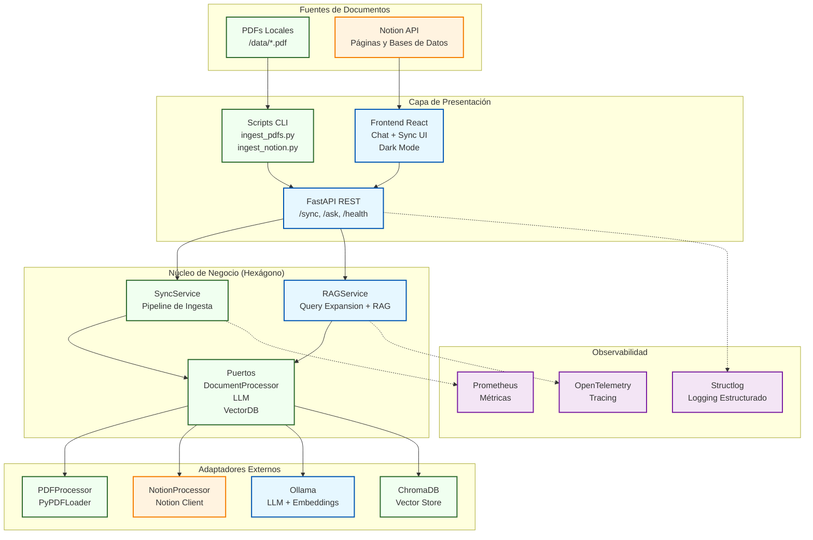
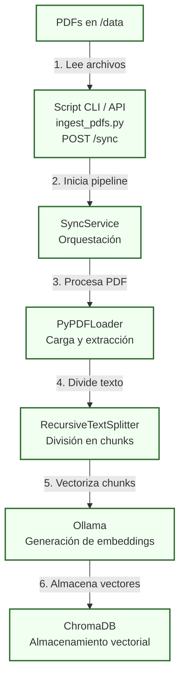
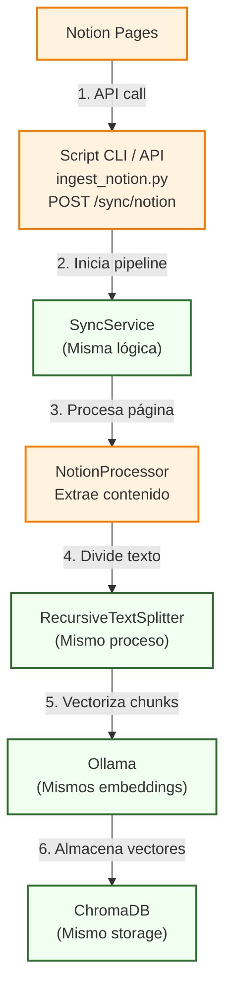
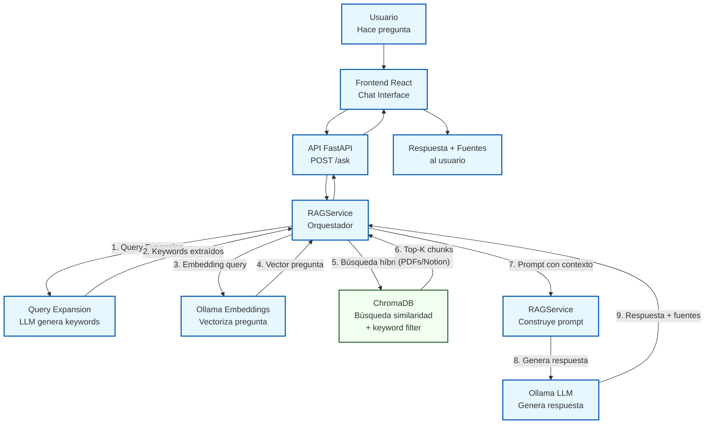
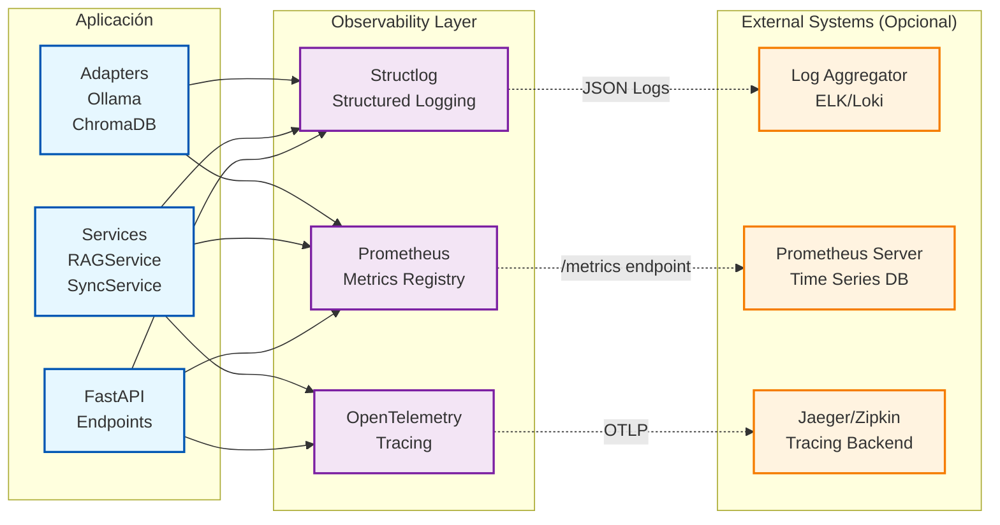

# 🤖 tfm-bibliotecario-ia


TFM que implementa un asistente RAG ('Bibliotecario IA') para consultar documentos (PDFs locales y Notion) usando Ollama y LangChain.

---

## 📖 Descripción del Proyecto

**`bibliotecario-ia`** es un Trabajo Final de Máster que demuestra la implementación de un sistema RAG (Retrieval-Augmented Generation) de principio a fin, enfocado en la privacidad y la arquitectura de software desacoplada.

El objetivo es crear un *chatbot* capaz de responder preguntas sobre una base de conocimiento privada (alojada en **Notion**) utilizando un modelo de lenguaje que se ejecuta localmente (**Ollama**). Esto garantiza que los datos sensibles nunca abandonen la máquina local.

El sistema se construye sobre una **Arquitectura Hexagonal** para asegurar que los componentes (API, lógica de IA, bases de datos) estén desacoplados y sean fáciles de mantener o sustituir.

## 🛠️ Stack Tecnológico

* **Framework Backend:** **Python** con **FastAPI**
* **Orquestación de IA:** **LangChain** con **Query Expansion**
* **Modelo de Lenguaje (LLM):** **Ollama** (ej. `llama3.2`)
* **Base de Datos Vectorial:** **ChromaDB**
* **Fuentes de Datos:** **PDFs locales** y **Notion API**
* **Frontend:** **React 18** + **Vite 5** + **Tailwind CSS v4** (Dark Mode)
* **Observabilidad:** **Structlog** + **Prometheus** + **OpenTelemetry**
* **Contenerización:** **Docker Compose**

---

## 🏛️ Arquitectura del Sistema

El proyecto sigue un patrón de **Arquitectura Hexagonal (Puertos y Adaptadores)** y se desarrolla en fases incrementales:

* **MVP (Verde):** Pipeline de ingesta de PDFs locales - Garantiza funcionalidad básica del TFM
* **Fase 1 (Azul):** Sistema RAG completo para consultas - El chatbot IA con frontend React
* **Extensión (Naranja):** Integración con Notion API - Valor añadido y diferenciación


---

## 🔄 Flujos de Trabajo por Fases

El sistema implementa flujos de ingesta y consulta que demuestran la arquitectura hexagonal en acción.

### **MVP: Ingesta de PDFs Locales**
Pipeline de ingesta simple y robusto. Garantiza funcionalidad core del sistema sin dependencias externas. (Verde).



### **Extensión: Integración con Notion**
Mismo pipeline, diferente adaptador. Demuestra la flexibilidad de la arquitectura hexagonal. (Naranja).



### **Fase 1: Sistema RAG (Chatbot)**
El chatbot inteligente con Query Expansion que responde preguntas usando la base de conocimientos indexada. (Azul).



---

## 🔍 Observabilidad

El sistema incluye una **capa completa de observabilidad** para monitoreo en producción:

### **Logging Estructurado** (Structlog)
- Logs en formato JSON para fácil parsing
- Contexto enriquecido (request_id, user_id, timestamps)
- Niveles configurables por módulo

### **Métricas** (Prometheus)
- `vector_search_latency_seconds`: Latencia de búsquedas vectoriales
- `llm_generation_time_seconds`: Tiempo de generación del LLM
- `documents_synced_total`: Contador de documentos procesados
- Endpoint `/metrics` para scraping

### **Tracing** (OpenTelemetry)
- Trazas distribuidas end-to-end
- Spans para cada operación crítica
- Integración con Jaeger/Zipkin (opcional)

**Arquitectura de Observabilidad:**



**Ejemplo de uso:**
```python
# Los logs estructurados se generan automáticamente
logger.info("Query processed",
           query=query,
           results_count=len(sources),
           latency=duration)

# Las métricas se registran automáticamente
VECTOR_SEARCH_LATENCY.observe(duration)
```

---

## 📚 Documentación

| Documento | Descripción |
|-----------|-------------|
| **[docs/STRUCTURE.md](docs/STRUCTURE.md)** | Arquitectura y estructura del proyecto |
| **[docs/USAGE.md](docs/USAGE.md)** | API endpoints y scripts CLI |
| **[docs/USAGE_TESTING.md](docs/USAGE_TESTING.md)** | Suite de tests y guía de testing |
| **[.ai/context.md](.ai/context.md)** | Contexto para agentes IA |

---

## 🚀 Quick Start

### Prerequisitos

1. **Python 3.11+**
2. **Docker** (para ChromaDB)
3. **Ollama** instalado localmente (Para Mac/Desarrollo local) o en Docker (Para entornos productivos)

### Instalación

**Opción 1: Instalación Automática (Recomendada)**

```bash
# 1. Clonar repositorio
git clone <URL_DEL_REPO>
cd tfm-bibliotecario-ia

# 2. Ejecutar script de instalación
python3 setup.py
```

El script `setup.py` te guiará interactivamente por todo el proceso:
- Detecta qué está instalado y qué falta
- Te permite elegir entre Modo Docker o Modo Local/Híbrido
- Instala sólo lo necesario
- Configura el entorno automáticamente
- Ejecuta verificación al final

**Opción 2: Instalación Manual**

```bash
# 1. Clonar repositorio
git clone <URL_DEL_REPO>
cd tfm-bibliotecario-ia

# 2. Instalar Ollama y descargar modelos
brew install ollama  # macOS
ollama pull llama3.2
ollama pull nomic-embed-text

# 3. Setup Python
cd api
python -m venv venv
source venv/bin/activate  # macOS/Linux
pip install -r requirements.txt

# 4. Configurar variables de entorno
cp .env.example .env
# Editar .env con tus valores

# 5. Iniciar ChromaDB
cd ..
docker-compose up -d chromadb

# 6. Verificar setup
python scripts/verify_setup.py
```

### Uso Básico

**Opción A: Con Frontend (Recomendado)**

```bash
# Terminal 1: Ollama
ollama serve

# Terminal 2: ChromaDB
docker-compose up -d chromadb

# Terminal 3: API Backend
cd api && source venv/bin/activate
uvicorn app.main:app --reload

# Terminal 4: Frontend React
cd frontend
npm install  # Solo la primera vez
npm run dev

# Abrir navegador en http://localhost:5173
```

El frontend incluye:
- 💬 **Chat Interface** con Dark Mode
- 📊 **Panel de Estadísticas** en tiempo real
- 📁 **Sincronización de Documentos** (PDF y Notion) desde la UI
- 📈 **Visualización de Fuentes** con scores de relevancia

**Opción B: Solo API (sin Frontend)**

```bash
# Terminal 1: Ollama + API
ollama serve &
cd api && source venv/bin/activate
uvicorn app.main:app --reload

# Terminal 2: Ingestar documentos
python scripts/ingest_pdfs.py

# Terminal 3: Hacer consultas vía cURL
curl -X POST http://localhost:8000/ask \
  -H "Content-Type: application/json" \
  -d '{"question": "¿De qué tratan los documentos?"}'
```

Ver [docs/USAGE.md](docs/USAGE.md) para documentación completa de la API y scripts CLI.

---

## 📄 Licencia

Este proyecto está bajo la licencia MIT. Ver [LICENSE](LICENSE) para más detalles.

---

**Proyecto:** TFM Bibliotecario-IA
**Arquitectura:** Hexagonal (Puertos y Adaptadores)
**Stack:** Python + FastAPI + LangChain + Ollama + ChromaDB
